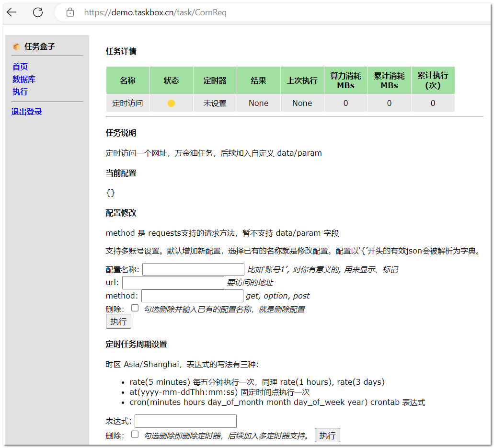

## 任务盒子 TaskBox

任务盒子（TaskBox，以下简称盒子）是一个运行在 Serverless 平台的个人定时任务框架。它注重稳定、性能和扩展性。基于 AWS Lambda + [DynamoDB][2] + S3 + APIGW + EventBridge scheduler 编写。

📦[演示地址](https://demo.taskbox.cn)


它有如下特点：

- 全免费，利用 AWS 给开发者的[永久免费额度](https://aws.amazon.com/cn/free/) 🎉
- 简单部署。基于 AWS SAM 应用模板，能自动的绝不手动。
- 定制的 web 网页，任务列表。支持任务增删改查，可绑定个人域名，向朋友秀出你的个人助手！
- 简单的登录鉴权功能，并利用 AWS Api-Gateway 做了**访问安全限制**，狠狠防住暴力破解！
- 配置、任务周期可在网页设置（不同任务支持自定义配置），cookie过期1秒钟更换！
- 注重性能。无 web 框架（flask/bottle等），无冗余代码。并得益于 AWS 函数计算和数据库的高可用、高性能，网页冷启动时间 1s 内，后续网页请求基本在 5ms 内完成。<small>不包含DynamoDB查询时延 10ms 以内</small>
- 提供了网页版的 Shell 和 Python 命令接口，临时使用不在话下。
- 极具扩展性。**任务插件化(Submodule 管理)**，根据贡献指南一分钟创建属于你的任务。还可在任务市场寻找~~丰富扩展~~求PR


### 1 如何使用

1、Fork 本仓库，并在你仓库的 setting -> Actions secrets 设置如下三个变量
```
AWS_ACCESS_KEY_ID 
AWS_SECRET_ACCESS_KEY
WEB_PASSWORD
```
前两个变量从你的 aws 账户获取，一般在[这里设置][1]，第三个是用来登录盒子的密码，现在鉴权方式比较简陋，所以推荐设置一个**强密码**。

2、推送一个 commit 到 master 分支触发自动部署到 AWS  
从 AWS api-gateway控制台或者 github action 任务回显能够找到访问的api。

TODO 一些权限问题导致的失败处理方式。

### 2 创建自己的任务

盒子具有很强的扩展性，以创建一个定时访问网址的任务为例。添加文件 `src/taskbox/user_task/taskcronreq.py`，内容如下

```
import requests

from taskbox.taskbase.task import Task
from taskbox.utils.tools import LOG

__all__ = ['CornReq']

class CornReq(Task):
    '''定时访问一个网址，万金油任务，后续加入自定义 data/param
    '''
    name_zh = '定时访问'

    def __init__(self, *args, **kwargs):
        super().__init__(*args, **kwargs)

    def step(self, config):
        '''这里是任务具体做的事情

        盒子会根据设置的周期，调用这个方法。返回的结果会显示在web的‘结果’一栏。
        '''
        res = getattr(requests, config.get('method'))(config.get('url'))
        return f'执行 {config} 成功：{res.json}'

    def get_conf_list(self):
        '''method 是 requests支持的请求方法，暂不支持 data/param 字段'''
        return {
            'url': '要访问的地址',
            'method': 'get, option, post',
        }

CornReq.register()
```
之后**盒子解析代码的注释和配置要求**，任务详情页会自动显示如下：


还可以通过 git submodule 管理任务 TODO

快速更新中，欢迎 PR

[1]: https://us-east-1.console.aws.amazon.com/iam/home#/security_credentials$access_key
[2]: https://docs.amazonaws.cn/amazondynamodb/latest/developerguide/Introduction.html 'DynamoDB介绍'
